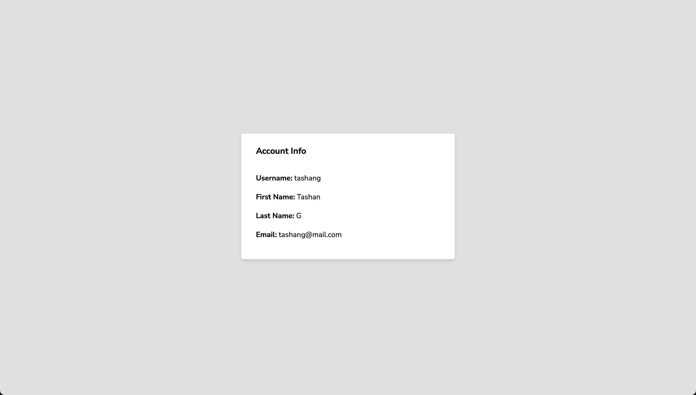

# Simple Login System

A lightweight web-based login system that demonstrates basic user authentication with registration, login, and profile display. It uses a SQLite database to store user credentials and details, and includes simple form validation to ensure a smooth user experience.

---

## Table of Contents

- [Overview](#overview)
- [Features](#features)
- [Tech Stack](#tech-stack)
- [Installation & Setup](#installation--setup)
- [Usage](#usage)
- [Screenshots / Demo](#screenshots--demo)
- [License](#license)

---

## Overview

This project is built with Python and Flask to demonstrate a simple authentication flow:
- **Registration:** Users can sign up by providing a username and password. The system checks if the username is already taken.
- **User Details:** After registration, users can add their first name, last name, and email.
- **Login:** Registered users can log in to view their details on a display page.

---

## Features

- **User Registration:**  
  - New users can register with a unique username.
  - Validation prevents duplicate usernames.
  
- **User Details Input:**  
  - After registering, users can enter additional details (first name, last name, email).
  
- **User Login:**  
  - Users log in with their credentials and view their details.
  
- **Form Validation:**  
  - Checks for duplicate usernames during registration.
  - Validates credentials during login.

---

## Tech Stack

- **Backend:** Python, Flask  
- **Database:** SQLite (using SQLAlchemy)  
- **Frontend:** HTML, CSS  
- **Key Libraries:**  
  - Flask  
  - Flask-SQLAlchemy

---

## Installation & Setup

1. **Clone the Repository:**

  ```bash
  git clone https://github.com/gillemta/login-system.git
  cd login-system
  ```

2. **Create and Activate a Virtual Environment (Optional but Recommended):

  ```bash
  python -m venv venv
  source venv/bin/activate  # On Windows: venv\Scripts\activate
  ```

3. **Install Dependencies:**

  ```bash
  pip install -r requirements.txt
  ```

4. **Run the Application:

  ```bash
  python app.py
  ```
  Open your browser and go to http://localhost:5000 to see the app in action.

---

## Usage

- **Home Page:**  
  When you first load the project, you'll see a home page with two central buttons: **Register** and **Login**.

- **Register:**  
  Clicking the **Register** button takes you to the registration page where you can enter a username and password. If the username is already in use, a validation message will appear.

- **User Details:**  
  After a successful registration, you're redirected to the user details page where you can add your first name, last name, and email. Once submitted, you'll be taken to a display page showing your information.

- **Login:**  
  Use your credentials to log in and be redirected directly to the display page with your details.

---

## Screenshots / Demo

Here are some visuals to help you understand the flow:

**Home Page:**  


**Registration Page:**  


**User Details Page:**  


**Display Info Page:**  

